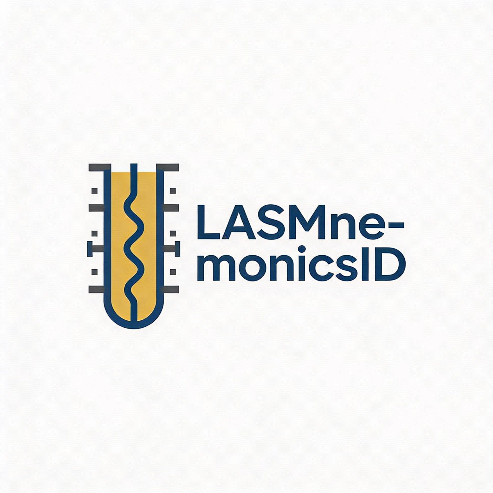

{width=50 height=25}

# LASMnemonicsID

LASMnemonicsID identifies well log mnemonics from LAS and DLIS/LIS files using Python dictionaries, lasio, and dlisio to load into pandas DataFrames.[web:6][web:11][memory:1]

## Features

- LAS reading via lasio to DataFrames with mnemonic ID.[web:7]
- DLIS/LIS via dlisio, standardized via dictionaries.[web:11]
- Petrophysics/reservoir analysis support.

## Installation
pip install lasio dlisio pandas lasmnemonicsid

## Quick Start

```python
from lasmnemonicsid import identify_mnemonics, load_las_df, load_dlis_df

df_las = load_las_df('example.las')
mnems = identify_mnemonics(df_las.columns)
print(mnems)
```
License

MIT License

Copyright (c) 2026 [Your Name]

Permission is hereby granted, free of charge, to any person obtaining a copy of this software... [full text as before].[web:21]

text

Adjust width/height pixels as needed (e.g., 150x75); GitHub renders it proportionally. Test preview to confirm.[1]
